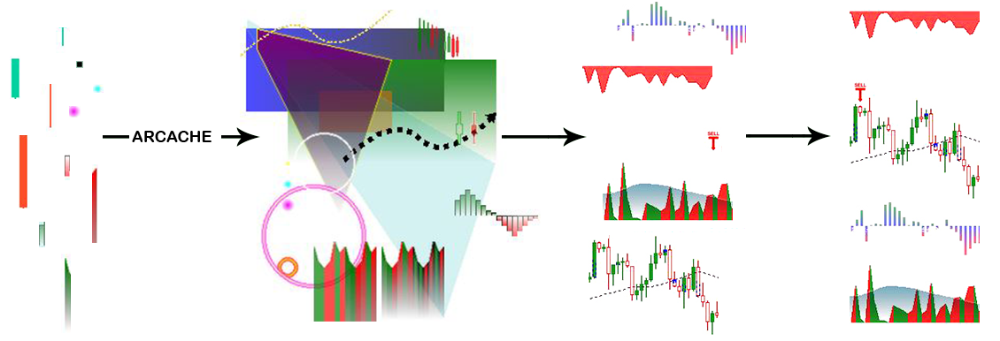

.. rcache documentation master file, created by
   sphinx-quickstart on Sat Feb 19 15:02:58 2022.
   You can adapt this file completely to your liking, but it should at least
   contain the root `toctree` directive.

Welcome to rcache's documentation!
==================================

.. toctree::
   :maxdepth: 2
   :caption: Contents:

A serialized slug-cache for Python using PIL and TKinter.

RCache is designed to take image generation logic in the form of a callback and "slugify" the output. It will then key
it using the name, file, and arguments. This allows for many variations of smaller image "constructors" to be
stored for rapid use when producing more complex composites.

Placement
---------

constructor << rcache << element << widget << canvas

Config
------

RCache's configuration file is specified as an argument when either the Cache or SlugCache classes are initialized.
If no file is specified the defaults.ini will be used instead:

.. code-block:: ini

   [cache]
   cache_dir = '.imgcache'             # Images will optionally be stored and read from here when debug_images is set to True
   error_dir = 'rcache_errors'         # Images that fail to load will be place here to allow for inspection.
   preload = True                      # When set to True we will scan and update the cache during initialization.
   cache_max = 5000                    # Specified the maximum number of items the cache will allow.
   debug_images = True                 # When set to True processed images will be left in the cache_dir for easy review.
   purge_cache_on_startup = False      # When set to True the cache binary file and folder will be removed during initialization.

Examples
--------
``basic usage:``

.. code-block:: python

   import os
   from PIL import Image
   from rcache import SlugCache

   cache = SlugCache(config_file=os.path.abspath(os.path.dirname(__file__)) + '/my_config.ini')

   def icon(file: [str, Path], fill: str, size: int) -> Image:
      """
      A working example of this can be found in tests.
      """
      file = Path(file)
      mask = Image.open(file)
      mask = mask.resize((size, size), resample=Image.ANTIALIAS)
      mask = mask.convert('L')
      image = Image.new("RGB", (size, size), fill)
      image.putalpha(mask)
      return image

   def make_icon(**kwargs)
      """
      A function that will be used to create many images with various parameters.
      """
      return SlugCache.provide(icon, *[], **kwargs)

   kwargs = {
      'file': 'my_icon.png',
      'fill': 'green',
      'size': 100,
      'raw': True  # Tell the cache to return a PIL.Image instead of an ImageTk.
   }

   image = make_icon(**kwargs)  # Can be called many times but will return from cache instead of recomputing the icon.
   image.show()

``Keyword argument filtration:``

.. code-block:: python

   args = [x1, y1, x2, y2, x3, y3, x4, y4]  # A very PIL looking set of coordinates.
   kwargs = {
      'placement': {'x': 25, 'y': 50},  # As these will be unique to where the image is placed but not to the image itself...
      'fill': 'green',
      'outline': 'blue',
      'exclude': 'placement'  # Tell the cache to ignore the placement coordinates when keying the image.
   }
   image_tk = SlugCache(callback, *args, **kwargs)

``Updating, saving and clearing the cache contents:``

.. code-block:: pycon

   >>> from pathlib import Path
   >>> from rcache.cache import SlugCache
   >>> cache = SlugCache(Path('my_config.ini'))  # Initialize the cache (This also performs a cache.refresh; however, we show it below for the sake of the example).
   >>> cache.refresh()  # This rescans all configured cache_dir folder for new images.
   >>> cache.save_file()  # Save the cache contents (alternatively this can be accomplished with "cache.refresh(resave=True)").
   >>> cache.clear(persistent=True)  # When persistent is set both the memory and file caches will be cleared.

Disclaimer
----------

This library is still in development, please use at your own risk and test sufficiently before using it in a
production environment.

Indices and tables
==================

* :ref:`genindex`
* :ref:`modindex`
* :ref:`search`
